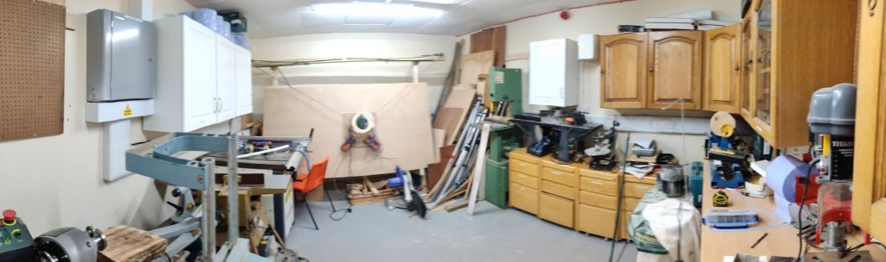
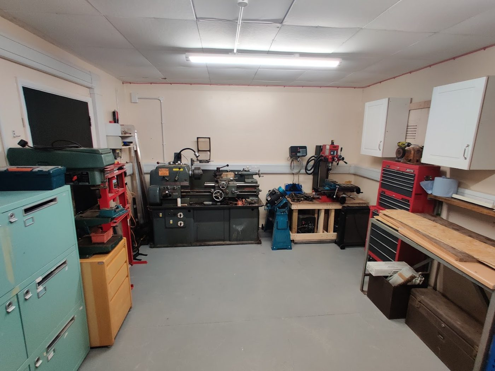
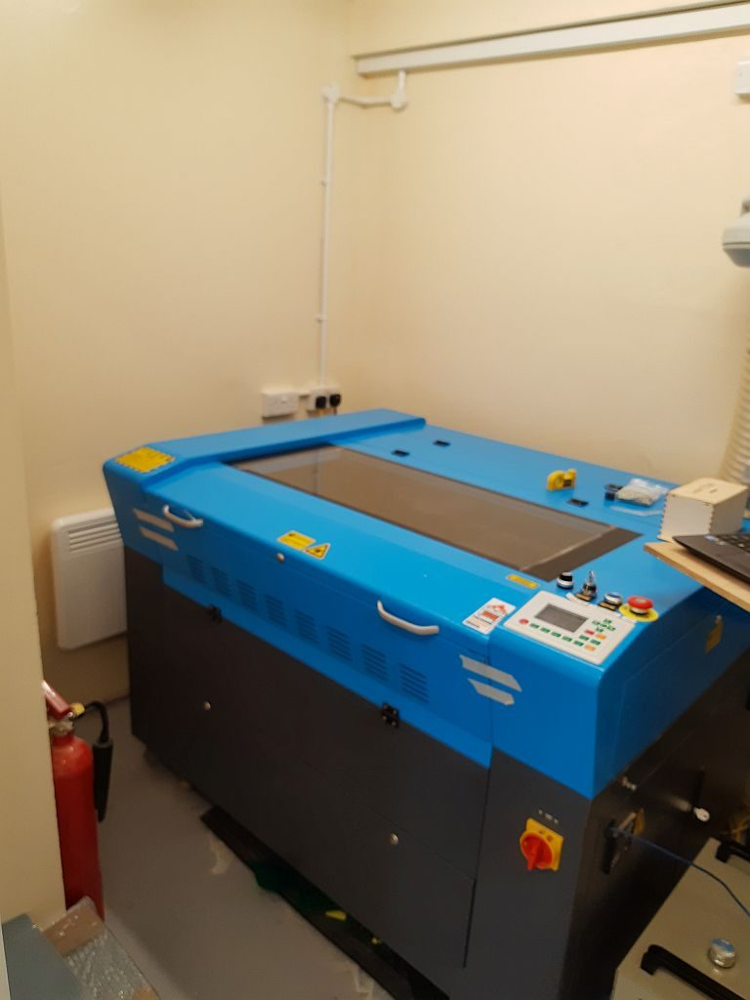
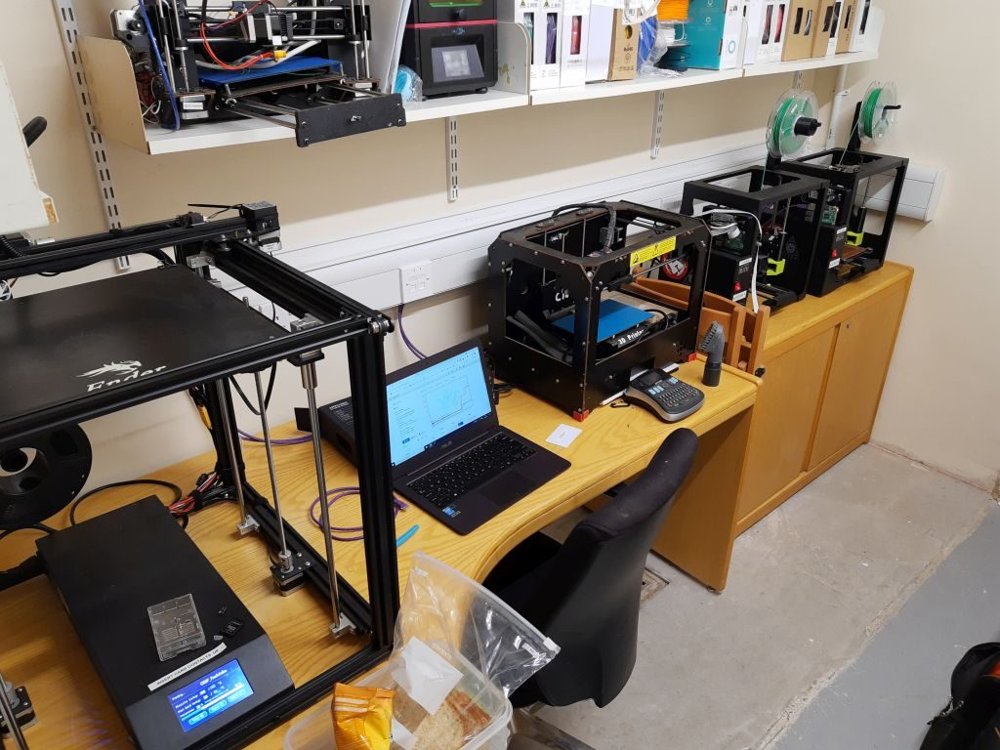
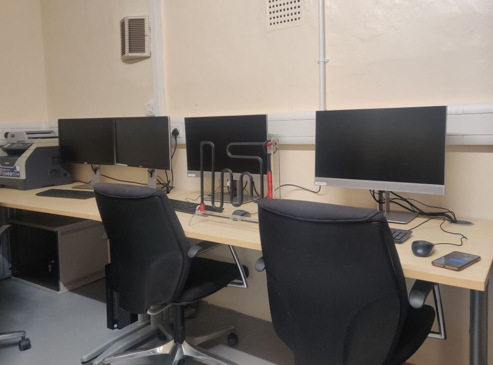
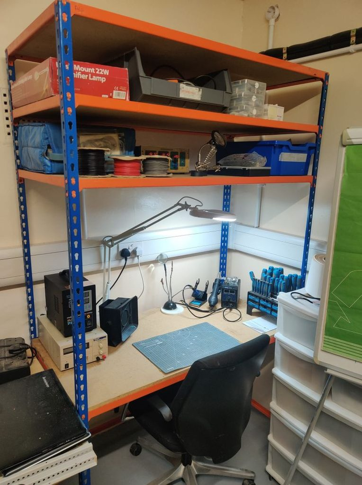
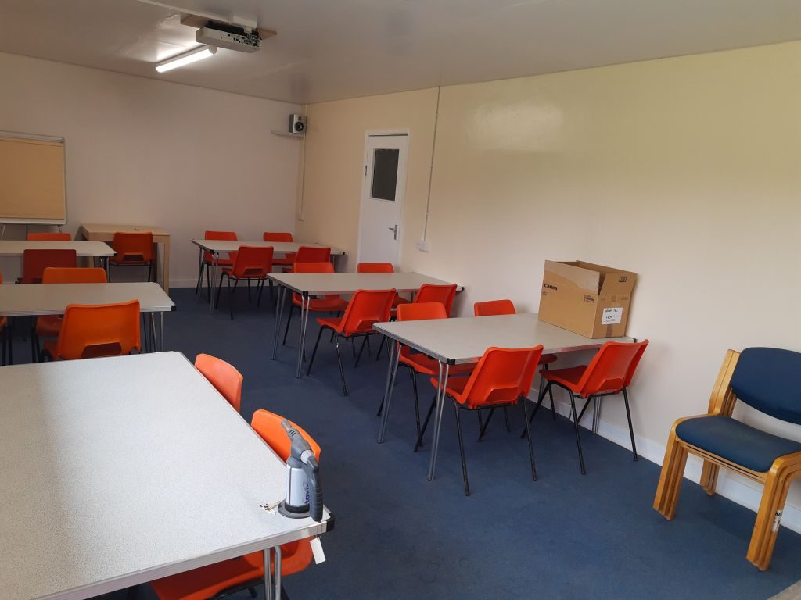
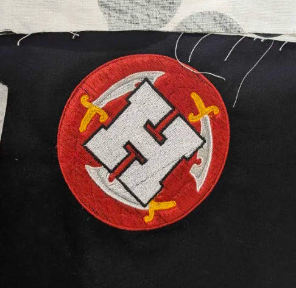
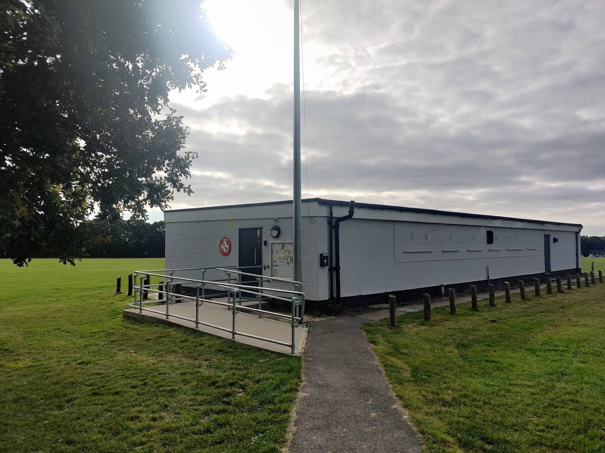

{% include hero.html
  title="East Essex Hackspace"
  lead="A community workshop in Hawkwell where you can use tools you don't have at home, learn new skills and meet people who make things."
  photo="images/hackspace-outside.jpg"
  logo="images/eeh-logo.png"
  cta_solid_text="Visit on a Tuesday evening"
  cta_solid_href="/find-us/"
  cta_outline_text="Join"
  cta_outline_href="/join-us/"
  where="Hawkwell Pavilion, Park Gardens, Hockley, Essex SS5 4HF · run entirely by volunteers · registered charity 1190927"
%}


## What's a hackspace?

A hackspace is a workshop shared by its members. Ours is run as a charity by volunteers: everyone chips in for the tools, the space and the know-how, so together we can make, fix and learn things that none of us could manage alone in a shed or on the kitchen table.

Don't be put off by the name. "Hack" here is the old-fashioned kind - tinkering, mending, improvising and finding clever ways to make things work. It has nothing to do with breaking into computers.

It's for anyone aged 18 or over: hobbyists, repairers, crafters, students, retired engineers, people with a broken thing and a hunch it could be saved, and people who just want to learn a new skill in good company. You don't need any experience - members are happy to show you the ropes.

Think of it as a shared shed, or a gym membership for tools: instead of buying a lathe, a laser cutter and a 3D printer you'll each use twice a year, we share them - along with the skills to use them safely.




## What you can use

The building is a converted sports pavilion, and the old changing rooms now house a series of well-equipped workshops. There's also a WAZER waterjet cutter that can cut metal, and a refurbished kitchen for hot drinks and warm snacks.

  <figure>
    
    <figcaption><strong>Wood workshop</strong> Table saw, lathe, CNC, bandsaw and plenty of hand tools.</figcaption>
  </figure>
  <figure>
    
    <figcaption><strong>Metal workshop</strong> Large machine tools including a lathe and milling machine - kit you're unlikely to find in a typical hobbyist workshop.</figcaption>
  </figure>
  <figure>
    
    <figcaption><strong>Laser cutting room</strong> A 900&thinsp;mm × 600&thinsp;mm 80&thinsp;W CO₂ laser cutter and a MOPA fibre laser for precision engraving and marking.</figcaption>
  </figure>
  <figure>
    
    <figcaption><strong>3D printing</strong> Four modern FDM 3D printers, three with multi-material capabilities: 2× Bambu X1C, 1× Prusa XL and 1× FLSUN V400.</figcaption>
  </figure>
  <figure>
    
    <figcaption><strong>Computer lab</strong> PCs for general use, CAD, 3D modelling and working with our 3D printers.</figcaption>
  </figure>
  <figure>
    
    <figcaption><strong>Electronics</strong> A fully equipped electronics workbench with everything you need to build, test and repair projects.</figcaption>
  </figure>
  <figure>
    
    <figcaption><strong>Social space</strong> A comfortable space to socialise, share ideas, give talks and run workshops and events - with A/V equipment and a hearing loop.</figcaption>
  </figure>
  <figure>
    
    <figcaption><strong>Textiles</strong> Learn to sew, work with leather, weave electronics into clothing, and explore all kinds of textile crafts.</figcaption>
  </figure>

The [wiki](https://wiki.eehack.space/) has the full detail on every workshop, tool and induction.
{: .wiki-note}






<a class="btn btn-solid" href="/join-us/">More about joining</a>





## Repair café and community

We're not just for members. We run a public **repair café** where volunteers help fix broken household items - from lamps and toasters to clothing and toys - rather than see them thrown away. Bring something broken and we'll have a go at mending it together. <!-- VERIFY: repair café frequency — the wiki and current site say "typically every three months, usually on a Sunday"; more recent reports suggest roughly monthly on the last Saturday. Check with the events team before publishing a frequency. --> Check the [event calendar](https://wiki.eehack.space/index.php/Main_Page#Calendar_of_Events) or the [Facebook group](https://www.facebook.com/groups/eastessexhackspace) for the next date.

There's also a **tool library**, plus hackathons, workshops and talks through the year.

The hackspace began with volunteers making face shields and other PPE for local healthcare workers during the 2020 lockdown, and that community spirit has stuck: repair cafés have saved hundreds of items from landfill, and members have refurbished laptops for local schoolchildren.

If you'd like to volunteer at a repair café - fixers, sewers and tea-makers all welcome - [get in touch](mailto:info@eehack.space) or ask on [Discord](https://discord.gg/KftFA5S).




## Support the hackspace

East Essex Hackspace is a registered charity run entirely by volunteers. Every pound goes on rent, heating, insurance, consumables and equipment.

### Donate

You can donate through [JustGiving](https://www.justgiving.com/eehackspace). If you're a UK taxpayer, Gift Aid adds 25% to your donation at no cost to you.

### Volunteer

The space is run by its members, for its members - from fixing the plumbing to running inductions. If you'd like to help, come along on a Tuesday or say hello on [Discord](https://discord.gg/KftFA5S).

### Sponsor equipment

If your organisation would like to sponsor a tool, a room or a project, email [info@eehack.space](mailto:info@eehack.space) - we'd love to talk.

<a class="btn btn-solid" href="https://www.justgiving.com/eehackspace">Donate on JustGiving</a>





## Find us

  

    <address class="address">
      East Essex Hackspace CIO 
      Hawkwell Pavilion 
      Park Gardens 
      Hockley, Essex 
      SS5 4HF
    </address>
    <ul class="tidy">
      <li>what3words: <a href="https://what3words.com/tripods.normal.outlined">tripods.normal.outlined</a></li>
      <li><a href="https://www.google.com/maps/dir/?api=1&amp;destination=51.596974,0.672686">Directions on Google Maps</a></li>
    </ul>
    
We're the white former sports pavilion at Clements Hall recreation ground. There's free parking by the space, and Hockley station is walkable. See <a href="/find-us/">parking, train and cycling notes</a>.

  

  <figure>
    
    <figcaption>Look for the white pavilion with the red logo by the door.</figcaption>
  </figure>



